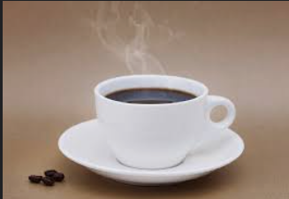
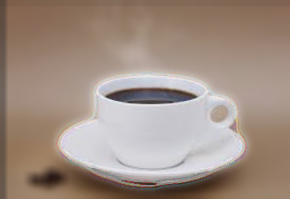
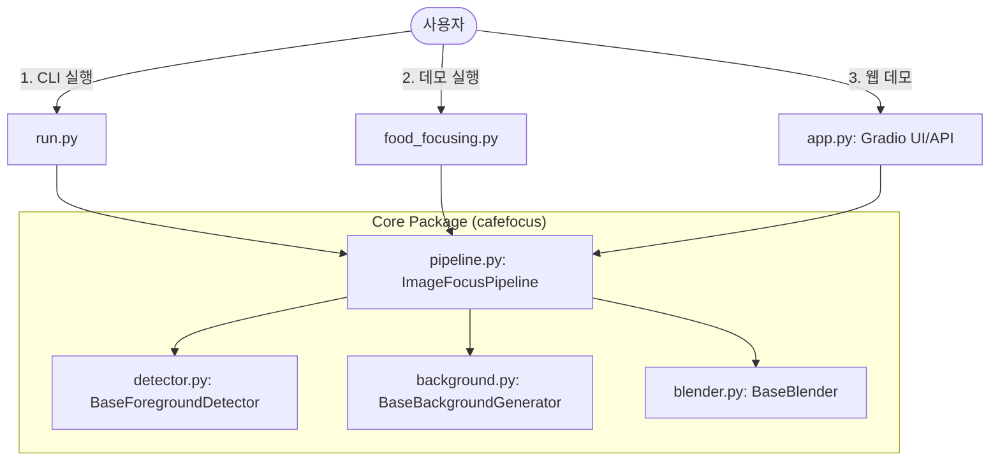
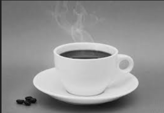
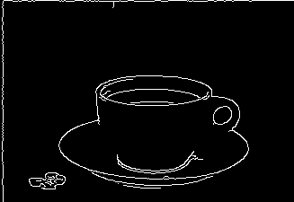
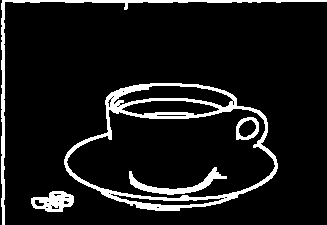
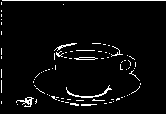
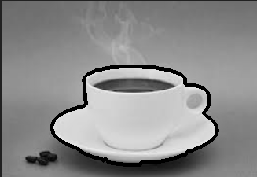

# ☕ Cafe-Focusing

> **🌐 Live Demo:** **[demo-gateway.trealight112.workers.dev/cafe-focusing](https://demo-gateway.trealight112.workers.dev/cafe-focusing/)** — 직접 이미지를 올려 체험해보세요!  
> **Project Date:** 2021.10.18 ~ 2021.12.18  
> **Collaborator:** @malangcongdduck  
> **Refactored Date:** 2026.06.25  

OpenCV 이미지 필터링과 Contour 분석 기술을 통해 스마트폰 카메라의 일반적인 원형 포커싱 필터 한계를 넘어서서, 카페 음료나 제과류 등 비정형 피사체의 외곽선을 정교하게 찾아내어 배경을 흐리게(Out-focusing) 만드는 라이브러리 및 도구입니다.

**2026.08 확장:** 고전 CV 검출기(윤곽선·Otsu)에 더해 **U2-Net 딥러닝 세그멘테이션**(onnxruntime CPU 추론)과 **GrabCut 박스 지정 모드**를 추가해 복잡한 배경에서도 정확한 피사체 분리가 가능해졌고, 원형 커널 기반 **보케(Bokeh) 블러**로 실제 카메라 렌즈의 빛망울 효과를 재현할 수 있습니다. 라이브 데모에서 네 가지 검출 방식을 같은 이미지로 비교해보세요.

---

## 📖 프로젝트 개요

### **기본 카메라의 포커싱 한계 개선**
갤럭시와 아이폰 등의 모바일 기본 카메라 앱에서는 **음식 및 인물사진 필터**를 지원합니다. 이 필터들은 대개 화면 중앙부나 고정된 원 모양 영역에만 초점(Focus)을 맞추고 주변을 흐리게 만듭니다. 그러나 이러한 고정된 형태의 필터는 카페 음료잔(세로형)이나 빵(불규칙형) 등 독특한 외형을 가진 피사체를 **제대로 포커싱하지 못하고 피사체까지 흐려버리는 한계**가 있습니다. 

우리 팀은 딥러닝과 같은 고비용 인공지능 기술 없이, 오직 가벼운 **OpenCV 이미지 분석 기법만으로 물체의 윤곽선을 정확히 찾아 그 바깥 범위만 정교하게 아웃포커싱이 적용되는 기능**을 구현하기 위해 본 프로젝트를 진행하였습니다.

<p align="center">
  
  
  <br/>
  <em>왼쪽: 원본 이미지 / 오른쪽: 비정형 경계선 아웃포커싱 최종 합성 이미지</em>
</p>

---

## 🌐 라이브 데모 아키텍처

정적 호스팅과 연산 서버를 분리한 2-티어 구조로 서비스합니다.

```text
[커스텀 프론트엔드]                         [백엔드 API]
Cloudflare (demo-gateway/cafe-focusing/) ──▶ Hugging Face Spaces (Gradio API)
드래그앤드롭·Ctrl+V 입력,                     app.py — cafefocus 파이프라인을
원본↔결과 비교 슬라이더,                      REST API로 노출 (CPU 실행)
처리 단계 갤러리
```

- **프론트엔드**: [demo-gateway 저장소](https://github.com/Kim-jin-gwang/demo-gateway)의 `cafe-focusing/` — 브라우저에서 `@gradio/client`로 API 호출
- **백엔드**: 이 저장소의 `app.py` 기반 → [HF Space `kimjgwang/ml-demos`](https://huggingface.co/spaces/kimjgwang/ml-demos) (HF 무료 티어 Space 개수 제한으로 GreenGlossary와 통합 호스팅)
- **로컬 실행**: `pip install -r requirements.txt` 후 `python app.py` → http://localhost:7860

---

## 📂 디렉터리 구조 (Directory Structure)

본 프로젝트는 핵심 알고리즘을 모듈화하여 확장성 있게 패키지화(`cafefocus/`)하고, CLI 실행 도구(`run.py`), 시각화 데모 스크립트(`food_focusing.py`)로 구성되어 있습니다.

```text
Cafe-Focusing/
├── cafefocus/              # 확장 가능한 아웃포커싱 핵심 패키지
│   ├── __init__.py         # 패키지 진입점 (핵심 컴포넌트 Export)
│   ├── pipeline.py         # 전체 포커싱 파이프라인 (ImageFocusPipeline)
│   ├── detector.py         # 전경/피사체 탐지기 모듈 (Contour, Otsu, GrabCut, U2-Net AI)
│   ├── background.py       # 배경 처리 모듈 (Blur/Bokeh, Desaturate, Darken 등)
│   └── blender.py          # 합성/블렌더 모듈 (AlphaBlend, LegacyAnd)
├── app.py                  # 라이브 데모용 Gradio 웹 UI / API 서버 (HF Spaces 배포)
├── run.py                  # CLI 명령줄 기반 아웃포커싱 실행 스크립트
├── requirements.txt        # 프로젝트 구동에 필요한 라이브러리 의존성 목록
├── food_focusing.py        # 시각화 데모 및 튜토리얼 스크립트 (.ipynb 변환 완료)
├── README.md               # 프로젝트 상세 기술 명세서 및 가이드
└── example_process_img/    # 예제 이미지 및 단계별 결과 예시 리소스 폴더
    └── food_solo.png       # 기본 테스트 대상 카페 음료 이미지
```

### **구동 모듈 및 아키텍처 관계도**



---

## 🎯 사용한 기술 및 구현 과정

최대한 가볍고 쉽게 사용할 수 있도록 인공지능의 영역분할 기술이 아닌 **opencv 함수만을 이용한 프로젝트 구현**을 목적으로 하여 **에지 검출, 에지 윤곽 검출 및 영역 정렬, 가우시안 블러** 등의 기술을 이용해 프로젝트를 진행하였습니다.

- **Edge 및 윤곽선 검출**
  - **Canny Edge** 검출을 통해 물체의 1차적인 에지를 식별합니다.
  - 최외곽 검출을 위해 **Contour(등고선)** 검출 함수 `findContours()`를 사용하여 가장 바깥 외곽선만 추출한 뒤 가장 큰 넓이(`contourArea`)를 찾아 다각형 마스크 영역으로 선별합니다.
- **모폴로지 기법**
  - 노이즈 제거 및 경계선 연결 굵기 조절을 위해 이미지 팽창(Dilate)과 침식(Erode) 연산을 연속적으로 적용하여 유효 윤곽 범위를 다듬습니다.
- **스무딩 및 블러**
  - 생성된 이진 마스크의 날카로운 테두리선을 부드럽게 만들기 위해 **가우시안 블러(GaussianBlur)** 및 모폴로지 가공을 거쳐 스무딩 마스크를 완성합니다.
  - 배경 영역은 피사체 대비 극적인 흐림 효과를 제공하기 위해 **평균 블러(Average Blur)**를 적용하여 아웃포커싱 처리합니다.
- **이미지 합성 (Blending)**
  - **개선된 알파 블렌딩 (기본값):** 전체 원본 이미지를 흐리게 한 배경 이미지에, 3채널로 확장 후 정규화한 알파 마스크를 가중치로 적용해 선형 합성(`alpha * 원본 + (1 - alpha) * 배경`)하여 부드럽고 자연스러운 아웃포커싱 효과를 구현합니다.
  - **레거시 합성 (옵션):** 마스크 기준으로 전경(오브젝트)과 배경을 흰색 배경 위에 독립 분리한 후, 분리된 배경을 블러 처리하고 최종적으로 두 이미지를 비트 연산(`bitwise_and`)으로 논리 병합하여 합성합니다.

---

## 🔍 전체 처리 단계 시각화 (Step-by-Step)

아래 이미지는 원본 입력부터 에지 검출, 마스크 생성 및 최종 합성까지 이어지는 점진적인 처리 공정입니다.

| 1. 원본 (Original) | 2. 그레이스케일 (Gray) | 3. 에지 검출 (Canny Edge) | 4. 에지 팽창 (Dilate) |
|:---:|:---:|:---:|:---:|
|  |  |  |  |

| 5. 에지 침식 (Erode) | 6. 외곽선 탐지 (Contour) | 7. 마스크 스무딩 (Smoothing) | 8. 아웃포커싱 완료 (Mixed) |
|:---:|:---:|:---:|:---:|
|  |  |  |  |

---

## 🙋‍♂️ 나의 역할

- **알파 블렌딩 기반 이미지 합성 파이프라인 개발:** 기존 레거시 `bitwise_and` 방식에서 발생하는 경계면의 거친 테두리와 색상 번짐 문제를 해결하기 위해, 정규화된 3차원 알파 마스크를 가중치로 삼아 원본과 흐려진 전체 배경 이미지를 부드럽게 선형 결합하는 알파 블렌딩 기법을 전담 설계하고 구현했습니다.
- **레거시 합성 지원 및 리팩토링:** 기존의 흰색 배경 기반 객체/배경 분리 및 `bitwise_and` 병합 알고리즘을 하위 호환성을 위해 `blend_legacy` 메소드로 캡슐화하고, CLI 구동부(`run.py`)에서 `--legacy` 옵션을 통해 두 합성 방식을 선택적으로 호출할 수 있도록 모듈식으로 통합 리팩토링했습니다.

---

## 🏆 주요 성과

- **기존 포커싱 한계 극복:** 당시 휴대폰 카메라의 고정된 원 모양 포커싱이 가진 한계를 벗어나, 음료나 빵 등 물체의 실제 윤곽선 모양에 맞추어 아웃포커싱 적용
- **선명한 아웃포커싱 효과:** 오브젝트와 배경을 성공적으로 분리한 후 배경에만 블러를 적용하여 다시 합성함으로써, 목표 피사체가 더 선명하게 돋보이는 결과물 도출
- **OpenCV 중심의 가벼운 구현:** 무거운 AI 딥러닝 모델 없이 이미지 처리 라이브러리 연산만으로 90% 수준의 높은 완성도를 달성

---

## 💥 트러블 슈팅 (Trouble Shooting)

### 1️⃣ 에지(Edge) 검출 시 발생하는 노이즈 및 윤곽선 끊김 문제
* **현상:** Canny Edge 검출만 사용할 경우, 피사체의 실제 외곽선 외에 주변 조명이나 물방울 등의 노이즈가 함께 에지로 추출되고 주요 선이 끊어지는 불안정이 나타났습니다.
* **원인:** 이미지 내의 세밀한 조명 변화와 유리잔 표면 반사광까지 세부 Edge로 인식했기 때문입니다.
* **해결방법:** 에지 검출 후 **모폴로지(Morphology)** 기법을 도입했습니다. `cv2.dilate` (팽창) 연산을 적용해 끊어진 미세한 얇은 에지선을 굵게 이어주어 닫힌 다각형을 만들고, `cv2.erode` (침식) 연산을 후속 적용해 흐릿하고 불필요한 배경 노이즈를 깎아내어 명확하고 닫힌 윤곽선을 구축했습니다.

### 2️⃣ 마스크 적용 시 경계선이 부자연스러운 문제
* **현상:** 추출한 윤곽선(Contour)을 바탕으로 마스크를 씌웠을 때, 피사체 경계가 포토샵으로 잘라 붙인 것처럼 너무 거칠고 날카롭게 분리되어 부자연스러웠습니다.
* **원인:** 다각형 외곽선 마스크 픽셀의 경계가 명확하게 0과 255로 급격히 전환되는 바이너리 형태였기 때문입니다.
* **해결방법:** 마스크에 팽창(Erode)과 침식(Dilate)을 재차 가해 테두리를 매끈하게 다듬은 후, **가우시안 블러(Gaussian Blur)**를 이용해 스무딩(Smoothing) 처리를 적용했습니다. 이로 인해 마스크의 경계선 부근에 부드러운 그라데이션 변화가 형성되어 원본 객체와 배경이 만나는 곳이 훨씬 은은하고 유기적으로 블렌딩되었습니다.

### 3️⃣ 레거시 합성(`bitwise_and`) 사용 시 경계선 잔상 및 색상 번짐 문제
* **현상:** 피사체와 배경을 완전히 분리하여 각각 블러 처리한 뒤 `bitwise_and` 연산으로 병합할 때, 경계선 부근에 흰색 테두리 잔상이 남거나 피사체의 색상이 번져 보이는 현상이 발생하였습니다.
* **원인:** 픽셀 데이터를 마스크 경계에서 0과 255(또는 0.0과 1.0)로 이진화하여 분리합성하는 과정에서, 블러(Blur) 필터 적용 시 경계면 픽셀들이 뭉개지고 bitwise 논리 연산이 픽셀의 선형 변형 값을 온전히 반영하지 못했기 때문입니다.
* **해결방법:**
  1. 기존의 객체/배경 분리 후 `bitwise_and` 합성을 하는 대신, **자연스러운 알파 블렌딩(Natural Alpha Blending)** 기법으로 전환하였습니다.
  2. 원본 이미지 전체를 흐리게 만든 배경 이미지(`blurred_bg`)를 생성합니다.
  3. 0~255 값의 스무딩 마스크를 0.0~1.0 사이의 알파 채널 가중치 값으로 정규화합니다.
  4. `알파 * 원본 이미지 + (1 - 알파) * 배경 이미지` 선형 보간 연산식을 적용하여 경계선 번짐과 부자연스러운 테두리 잔상이 완벽히 제거된 부드러운 합성 결과물을 얻었습니다.

---

## 🛠️ 실행 및 사용 방법

### **도커로 실행 (권장 — 환경 설정 불필요)**
```bash
docker build -t cafe-focusing .
docker run -p 7860:7860 cafe-focusing
```
→ http://localhost:7860 에서 Gradio 데모가 열립니다. AI 세그멘테이션 첫 사용 시 U2-Net 모델(~170MB)이 자동 다운로드됩니다.

### **프로젝트 라이브러리 및 가상환경 설정**
```bash
# 가상환경 생성 및 활성화
python -m venv .venv
# Windows (PowerShell):
.venv\Scripts\Activate.ps1
# Mac/Linux:
source .venv/bin/activate

# 의존성 패키지 설치
pip install -r requirements.txt
```

### **명령줄 실행 (CLI)**
리팩터링을 통해 새롭게 추가된 다양한 전경 탐지 모드 및 배경 특수 효과를 CLI에서 활용할 수 있습니다.
```bash
# 1. 기본 실행 (알파 블렌딩 포커싱 결과가 focused_result.png 로 저장됩니다)
python run.py example_process_img/food_solo.png

# 2. 전경 탐지기 교체 (Otsu thresholding 사용)
python run.py example_process_img/food_solo.png --detector otsu

# 3. 배경 특수 효과 적용 (배경 채도 감쇄 및 가우시안 블러 합성)
python run.py example_process_img/food_solo.png --bg-effect desaturate --bg-blur-type gaussian --saturation 0.2

# 4. AI 세그멘테이션 (U2-Net) + 보케 블러 — 첫 실행 시 모델(~170MB) 자동 다운로드
python run.py example_process_img/food_solo.png --detector ai --bg-blur-type bokeh --bg-blur 25

# 5. GrabCut 박스 지정 (이미지 대비 정규화 좌표 x,y,w,h)
python run.py example_process_img/food_solo.png --detector grabcut --grabcut-rect 0.2,0.15,0.6,0.7

# 6. 상세 단계별 이미지 저장과 함께 실행
python run.py example_process_img/food_solo.png --save-steps --steps-dir my_processing_steps
```
*(자세한 인자 사용법은 `python run.py --help` 명령어로 확인할 수 있습니다.)*

### **시각화 데모 및 튜토리얼 실행**
기존 주피터 노트북 대신 독립 실행형 파이썬 스크립트인 `food_focusing.py`를 실행하여 다양한 블렌딩 방식 및 확장된 파이프라인(Otsu 탐지기 + 채도 감쇄 배경)의 결과를 시각화하고 결과 차트 이미지를 생성합니다.
```bash
python food_focusing.py
```
*실행 완료 시, 다음 결과 차트들이 루트 폴더에 자동 생성됩니다:*
* `original_image_plot.png` (원본 이미지)
* `focusing_comparison_result.png` (합성 기법 및 파이프라인별 비교 차트)
* `pipeline_processing_steps.png` (상세 이미지 처리 8단계 시각화 차트)
